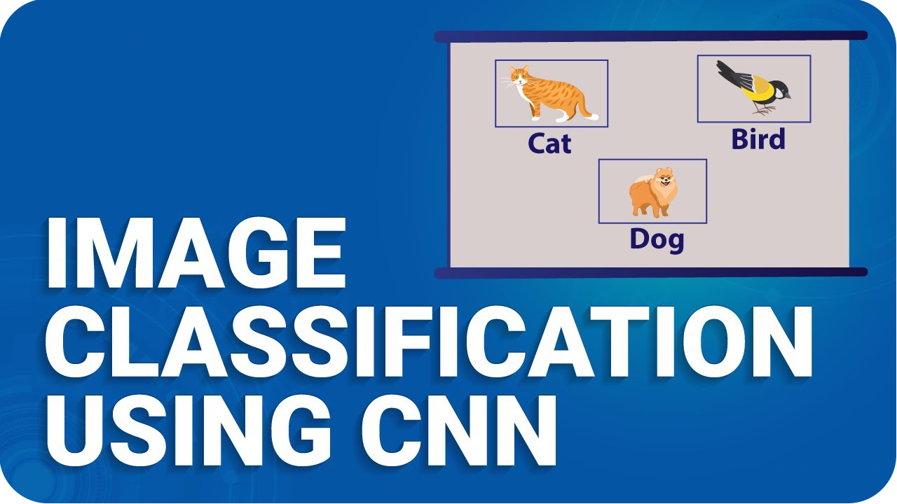

<!-- Improved compatibility of back to top link: See: https://github.com/othneildrew/Best-README-Template/pull/73 -->
<a name="readme-top"></a>
<!--
*** Thanks for checking out the Best-README-Template. If you have a suggestion
*** that would make this better, please fork the repo and create a pull request
*** or simply open an issue with the tag "enhancement".
*** Don't forget to give the project a star!
*** Thanks again! Now go create something AMAZING! :D
-->


<!-- PROJECT SHIELDS -->
<!--
*** I'm using markdown "reference style" links for readability.
*** Reference links are enclosed in brackets [ ] instead of parentheses ( ).
*** See the bottom of this document for the declaration of the reference variables
*** for contributors-url, forks-url, etc. This is an optional, concise syntax you may use.
*** https://www.markdownguide.org/basic-syntax/#reference-style-links
-->
[![Contributors][contributors-shield]][contributors-url]
[![Forks][forks-shield]][forks-url]
[![Stargazers][stars-shield]][stars-url]
[![Issues][issues-shield]][issues-url]
[![MIT License][license-shield]][license-url]
[![LinkedIn][linkedin-shield]][linkedin-url]


<!-- PROJECT LOGO -->
<br />
<div align="center">
  <a href="https://github.com/Abood-devo/simple-image-classifier">
    
  </a>

<h3 align="center">Simple image classifier</h3>

  <p align="center">
    Beginner-friendly image classifier built with PyTorch and CIFAR-10.
    <br />
    <a href="https://github.com/Abood-devo/simple-image-classifier"><strong>Explore the docs »</strong></a>
    <br />
    <br />
    <a href="https://github.com/Abood-devo/simple-image-classifier">View Demo</a>
    ·
    <a href="https://github.com/Abood-devo/simple-image-classifier/issues">Report Bug</a>
    ·
    <a href="https://github.com/Abood-devo/simple-image-classifier/issues">Request Feature</a>
  </p>
</div>


<!-- TABLE OF CONTENTS -->
<details>
  <summary>Table of Contents</summary>
  <ol>
    <li>
      <a href="#about-the-project">About The Project</a>
      <ul>
        <li><a href="#built-with">Built With</a></li>
      </ul>
    </li>
    <li>
      <a href="#getting-started">Getting Started</a>
      <ul>
        <li><a href="#prerequisites">Prerequisites</a></li>
        <li><a href="#installation">Installation</a></li>
      </ul>
    </li>
    <li><a href="#usage">Usage</a></li>
    <li><a href="#roadmap">Roadmap</a></li>
    <li><a href="#contributing">Contributing</a></li>
    <li><a href="#license">License</a></li>
    <li><a href="#contact">Contact</a></li>
    <li><a href="#acknowledgments">Acknowledgments</a></li>
  </ol>
</details>


<!-- ABOUT THE PROJECT -->
## About The Project

An image classifier is an ML model that recognizes objects in images. We can build image classifiers by feeding tens of thousands of labelled images to a neural network. Tools like PyTorch train these networks by evaluating their performance against the dataset.

<p align="right">(<a href="#readme-top">back to top</a>)</p>


### Built With

* [![Pytorch][Pytorch]][Pytorch-url]
* [![Jupyter][]][Jupyter-url]
* [![Numpy][]][Numpy-url]
* [![Matplotlib][]][Matplotlib-url]
* [![Tqdm][]][Tqdm-url]
* [![Cuda][]][Cuda-url]

<p align="right">(<a href="#readme-top">back to top</a>)</p>


<!-- GETTING STARTED -->
## Getting Started

You can either run the project locally on your device or in the cloud using [Google colab](https://colab.research.google.com/) follow the steps below for more details.

### Prerequisites

This is an example of how to list things you need to use the software and how to install them.
* npm
  ```sh
  npm install npm@latest -g
  ```

### Installation

1. Get a free API Key at [https://example.com](https://example.com)
2. Clone the repo
   ```sh
   git clone https://github.com/Abood-devo/simple-image-classifier.git
   ```
3. Install NPM packages
   ```sh
   npm install
   ```
4. Enter your API in `config.js`
   ```js
   const API_KEY = 'ENTER YOUR API';
   ```

<p align="right">(<a href="#readme-top">back to top</a>)</p>


<!-- USAGE EXAMPLES -->
## Usage

Use this space to show useful examples of how a project can be used. Additional screenshots, code examples and demos work well in this space. You may also link to more resources.

_For more examples, please refer to the [Documentation](https://example.com)_

<p align="right">(<a href="#readme-top">back to top</a>)</p>


<!-- ROADMAP -->
## Roadmap

- [ ] Feature 1
- [ ] Feature 2
- [ ] Feature 3
    - [ ] Nested Feature

See the [open issues](https://github.com/Abood-devo/simple-image-classifier/issues) for a full list of proposed features (and known issues).

<p align="right">(<a href="#readme-top">back to top</a>)</p>


<!-- CONTRIBUTING -->
## Contributing

Contributions are what make the open source community such an amazing place to learn, inspire, and create. Any contributions you make are **greatly appreciated**.

If you have a suggestion that would make this better, please fork the repo and create a pull request. You can also simply open an issue with the tag "enhancement".
Don't forget to give the project a star! Thanks again!

1. Fork the Project
2. Create your Feature Branch (`git checkout -b feature/AmazingFeature`)
3. Commit your Changes (`git commit -m 'Add some AmazingFeature'`)
4. Push to the Branch (`git push origin feature/AmazingFeature`)
5. Open a Pull Request

<p align="right">(<a href="#readme-top">back to top</a>)</p>


<!-- LICENSE -->
## License

Distributed under the MIT License. See `LICENSE.txt` for more information.

<p align="right">(<a href="#readme-top">back to top</a>)</p>


<!-- CONTACT -->
## Contact

Your Name - [@adfd_2](https://twitter.com/adfd_2) - email@Abdulqader@ieee.org.com

Project Link: [https://github.com/Abood-devo/simple-image-classifier](https://github.com/Abood-devo/simple-image-classifier)

<p align="right">(<a href="#readme-top">back to top</a>)</p>


<!-- ACKNOWLEDGMENTS -->
## Acknowledgments

* []()
* []()
* []()

<p align="right">(<a href="#readme-top">back to top</a>)</p>


<!-- MARKDOWN LINKS & IMAGES -->
<!-- https://www.markdownguide.org/basic-syntax/#reference-style-links -->
[contributors-shield]: https://img.shields.io/github/contributors/Abood-devo/simple-image-classifier.svg?style=for-the-badge
[contributors-url]: https://github.com/Abood-devo/simple-image-classifier/graphs/contributors
[forks-shield]: https://img.shields.io/github/forks/Abood-devo/simple-image-classifier.svg?style=for-the-badge
[forks-url]: https://github.com/Abood-devo/simple-image-classifier/network/members
[stars-shield]: https://img.shields.io/github/stars/Abood-devo/simple-image-classifier.svg?style=for-the-badge
[stars-url]: https://github.com/Abood-devo/simple-image-classifier/stargazers
[issues-shield]: https://img.shields.io/github/issues/Abood-devo/simple-image-classifier.svg?style=for-the-badge
[issues-url]: https://github.com/Abood-devo/simple-image-classifier/issues
[license-shield]: https://img.shields.io/github/license/Abood-devo/simple-image-classifier.svg?style=for-the-badge
[license-url]: https://github.com/Abood-devo/simple-image-classifier/blob/master/LICENSE.txt
[linkedin-shield]: https://img.shields.io/badge/-LinkedIn-black.svg?style=for-the-badge&logo=linkedin&colorB=555
[linkedin-url]: https://linkedin.com/in/Abdulqader-dada
[product-screenshot]: assets/maxresdefault.png
[Next.js]: https://img.shields.io/badge/next.js-000000?style=for-the-badge&logo=nextdotjs&logoColor=white
[Next-url]: https://nextjs.org/
[React.js]: https://img.shields.io/badge/React-20232A?style=for-the-badge&logo=react&logoColor=61DAFB
[React-url]: https://reactjs.org/
[Vue.js]: https://img.shields.io/badge/Vue.js-35495E?style=for-the-badge&logo=vuedotjs&logoColor=4FC08D
[Vue-url]: https://vuejs.org/
[Angular.io]: https://img.shields.io/badge/Angular-DD0031?style=for-the-badge&logo=angular&logoColor=white
[Angular-url]: https://angular.io/
[Svelte.dev]: https://img.shields.io/badge/Svelte-4A4A55?style=for-the-badge&logo=svelte&logoColor=FF3E00
[Svelte-url]: https://svelte.dev/
[Laravel.com]: https://img.shields.io/badge/Laravel-FF2D20?style=for-the-badge&logo=laravel&logoColor=white
[Laravel-url]: https://laravel.com
[Bootstrap.com]: https://img.shields.io/badge/Bootstrap-563D7C?style=for-the-badge&logo=bootstrap&logoColor=white
[Bootstrap-url]: https://getbootstrap.com
[JQuery.com]: https://img.shields.io/badge/jQuery-0769AD?style=for-the-badge&logo=jquery&logoColor=white
[JQuery-url]: https://jquery.com 
<!-- dependencies -->
[Pytorch-url]: https://pytorch.org
[Jupyter-url]: https://jupyter.org
[Numpy-url]: https://numpy.org
[Matplotlib-url]: https://matplotlib.org
[Tqdm-url]: https://tqdm.github.io/
[Cuda-url]: https://developer.nvidia.com/cuda-toolkit
<!-- dependencies shield -->
[Pytorch]: https://img.shields.io/badge/Pytorch-eb4d37?style=for-the-badge&logo=pytorch&logoColor=white
[Jupyter]: https://img.shields.io/badge/Jupyter-f07838?style=for-the-badge&logo=jupyter&logoColor=white
[Numpy]: https://img.shields.io/badge/numpy-%23013243.svg?style=for-the-badge&logo=numpy&logoColor=white
[Matplotlib]: https://img.shields.io/badge/Matplotlib-%23ffffff.svg?style=for-the-badge&logo=Matplotlib&logoColor=black
[Tqdm]: https://img.shields.io/badge/Tqdm-4999f4?style=for-the-badge&logo=tqdm&logoColor=f9ff4e
[Cuda]: https://img.shields.io/badge/Nvidia-Cuda-6fba2f?style=for-the-badge&logo=nvidia&logoColor=white